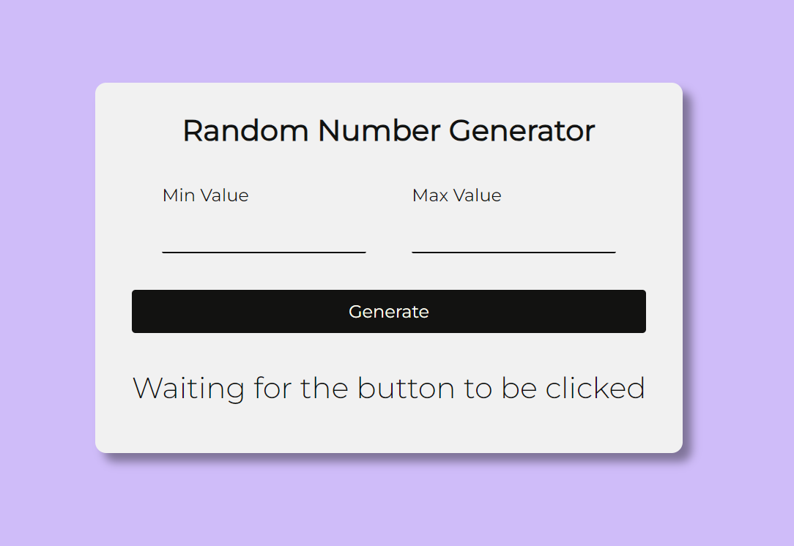

# Random Number Generator

A simple and user-friendly random number generator developed using HTML, CSS, and JavaScript. This project allows users to define minimum and maximum values and generates a random number within that specified range. The application is designed for ease of use and can be seamlessly integrated into other web projects.

## Overview

## Features

- Intuitive interface with dedicated input fields for minimum and maximum values.
- Input validations to ensure users enter valid numerical values.
- Instantaneous generation of random numbers upon button click.
- Organized code in separate files for easy maintenance.

## Usage

1. Clone the repository or download the project files.
2. Open the `index.html` file in your preferred web browser.

Feel free to contribute, report issues, or suggest improvements!

